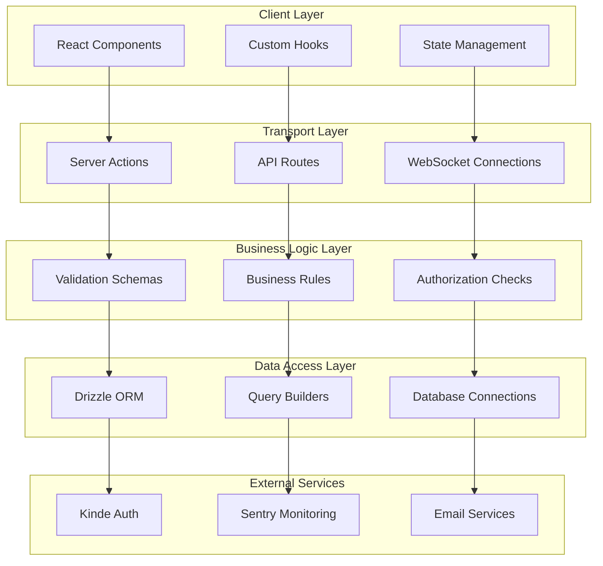

# 🔌 API Design Specifications - Francisco Computer Repair Shop

## 📋 API Overview

Comprehensive API design for the Computer Repair Shop management system, featuring Server Actions, RESTful endpoints, real-time data synchronization, and type-safe interfaces.

### 🎯 Design Principles
- **Type Safety**: Full TypeScript integration with runtime validation
- **Performance**: Optimized queries with caching and pagination
- **Security**: Authentication, authorization, and input sanitization
- **Reliability**: Error handling, retries, and graceful degradation
- **Developer Experience**: Clear interfaces and comprehensive documentation

---

## 🏗️ API Architecture

### **API Layers**


---

## 🔧 Server Actions API

### **Core Server Action Types**
```typescript
// Base server action response type with comprehensive error handling
interface ServerActionResponse<T> {
  success: boolean;
  data?: T;
  error?: {
    message: string;
    code: string;
    field?: string;
    details?: Record<string, any>;
  };
  validationErrors?: Record<string, string[]>;
  metadata?: {
    timestamp: string;
    version: string;
    requestId: string;
  };
}

// Server action configuration for enhanced functionality
interface ServerActionConfig {
  requireAuth: boolean;
  requiredPermissions?: string[];
  rateLimit?: {
    requests: number;
    windowMs: number;
  };
  cache?: {
    ttl: number;
    key: string;
  };
  monitoring?: {
    trackPerformance: boolean;
    logLevel: 'info' | 'warn' | 'error';
  };
}
```

### **Customer Management Actions**

#### **Create Customer**
```typescript
interface CreateCustomerInput {
  firstName: string;
  lastName: string;
  email: string;
  phone: string;
  address1: string;
  address2?: string;
  city: string;
  state: string;
  zip: string;
  country: string;
  notes?: string;
  active?: boolean;
}

export async function createCustomer(
  input: CreateCustomerInput
): Promise<ServerActionResponse<Customer>> {
  "use server";
  
  try {
    // Validate input with Zod schema
    const validatedData = customerInsertSchema.parse(input);
    
    // Check authentication and permissions
    const { user, hasPermission } = await getAuthContext();
    if (!hasPermission('customers:create')) {
      return {
        success: false,
        error: {
          message: 'Insufficient permissions',
          code: 'FORBIDDEN',
        }
      };
    }
    
    // Check for duplicate email
    const existingCustomer = await db
      .select()
      .from(customers)
      .where(eq(customers.email, validatedData.email))
      .limit(1);
      
    if (existingCustomer.length > 0) {
      return {
        success: false,
        error: {
          message: 'Customer with this email already exists',
          code: 'DUPLICATE_EMAIL',
          field: 'email',
        }
      };
    }
    
    // Create customer
    const newCustomer = await db
      .insert(customers)
      .values(validatedData)
      .returning();
    
    // Log activity
    await logActivity({
      action: 'customer:create',
      userId: user.id,
      resourceId: newCustomer[0].id,
      metadata: { email: validatedData.email }
    });
    
    return {
      success: true,
      data: newCustomer[0],
      metadata: {
        timestamp: new Date().toISOString(),
        version: '1.0',
        requestId: generateRequestId(),
      }
    };
    
  } catch (error) {
    // Handle validation errors
    if (error instanceof z.ZodError) {
      return {
        success: false,
        validationErrors: formatZodErrors(error),
      };
    }
    
    // Log unexpected errors
    await Sentry.captureException(error, {
      tags: { action: 'createCustomer' },
      extra: { input: sanitizeForLogging(input) }
    });
    
    return {
      success: false,
      error: {
        message: 'An unexpected error occurred',
        code: 'INTERNAL_ERROR',
      }
    };
  }
}
```

#### **Update Customer**
```typescript
interface UpdateCustomerInput extends Partial<CreateCustomerInput> {
  id: number;
}

export async function updateCustomer(
  input: UpdateCustomerInput
): Promise<ServerActionResponse<Customer>> {
  "use server";
  
  try {
    const validatedData = customerUpdateSchema.parse(input);
    
    const { user, hasPermission } = await getAuthContext();
    if (!hasPermission('customers:update')) {
      return {
        success: false,
        error: {
          message: 'Insufficient permissions',
          code: 'FORBIDDEN',
        }
      };
    }
    
    // Check if customer exists
    const existingCustomer = await db
      .select()
      .from(customers)
      .where(eq(customers.id, validatedData.id))
      .limit(1);
      
    if (existingCustomer.length === 0) {
      return {
        success: false,
        error: {
          message: 'Customer not found',
          code: 'NOT_FOUND',
        }
      };
    }
    
    // Update customer
    const updatedCustomer = await db
      .update(customers)
      .set({
        ...validatedData,
        updatedAt: new Date(),
      })
      .where(eq(customers.id, validatedData.id))
      .returning();
    
    return {
      success: true,
      data: updatedCustomer[0],
    };
    
  } catch (error) {
    return handleServerActionError(error, 'updateCustomer');
  }
}
```

#### **Delete Customer**
```typescript
export async function deleteCustomer(
  id: number
): Promise<ServerActionResponse<{ id: number }>> {
  "use server";
  
  try {
    const { hasPermission } = await getAuthContext();
    if (!hasPermission('customers:delete')) {
      return {
        success: false,
        error: {
          message: 'Insufficient permissions',
          code: 'FORBIDDEN',
        }
      };
    }
    
    // Check for existing tickets
    const existingTickets = await db
      .select({ count: count() })
      .from(tickets)
      .where(eq(tickets.customerId, id));
      
    if (existingTickets[0].count > 0) {
      return {
        success: false,
        error: {
          message: 'Cannot delete customer with existing tickets',
          code: 'HAS_DEPENDENCIES',
          details: { ticketCount: existingTickets[0].count }
        }
      };
    }
    
    // Soft delete by marking as inactive
    await db
      .update(customers)
      .set({ 
        active: false,
        updatedAt: new Date() 
      })
      .where(eq(customers.id, id));
    
    return {
      success: true,
      data: { id },
    };
    
  } catch (error) {
    return handleServerActionError(error, 'deleteCustomer');
  }
}
```

### **Ticket Management Actions**

#### **Create Ticket**
```typescript
interface CreateTicketInput {
  customerId: number;
  title: string;
  description: string;
  tech?: string;
  priority?: 'low' | 'medium' | 'high' | 'urgent';
  category?: string;
  estimatedHours?: number;
}

export async function createTicket(
  input: CreateTicketInput
): Promise<ServerActionResponse<Ticket>> {
  "use server";
  
  try {
    const validatedData = ticketInsertSchema.parse(input);
    
    const { user, hasPermission } = await getAuthContext();
    if (!hasPermission('tickets:create')) {
      return {
        success: false,
        error: {
          message: 'Insufficient permissions',
          code: 'FORBIDDEN',
        }
      };
    }
    
    // Verify customer exists and is active
    const customer = await db
      .select()
      .from(customers)
      .where(and(
        eq(customers.id, validatedData.customerId),
        eq(customers.active, true)
      ))
      .limit(1);
      
    if (customer.length === 0) {
      return {
        success: false,
        error: {
          message: 'Customer not found or inactive',
          code: 'INVALID_CUSTOMER',
        }
      };
    }
    
    // Create ticket with auto-assignment logic
    const assignedTech = validatedData.tech || await getNextAvailableTech();
    
    const newTicket = await db
      .insert(tickets)
      .values({
        ...validatedData,
        tech: assignedTech,
        createdAt: new Date(),
        updatedAt: new Date(),
      })
      .returning();
    
    // Send notification to assigned technician
    await sendTicketNotification({
      ticketId: newTicket[0].id,
      techEmail: assignedTech,
      type: 'assignment',
    });
    
    return {
      success: true,
      data: newTicket[0],
    };
    
  } catch (error) {
    return handleServerActionError(error, 'createTicket');
  }
}
```

#### **Update Ticket Status**
```typescript
export async function updateTicketStatus(
  id: number, 
  completed: boolean,
  notes?: string
): Promise<ServerActionResponse<Ticket>> {
  "use server";
  
  try {
    const { user, hasPermission } = await getAuthContext();
    
    // Check if user can update this specific ticket
    const ticket = await db
      .select()
      .from(tickets)
      .where(eq(tickets.id, id))
      .limit(1);
      
    if (ticket.length === 0) {
      return {
        success: false,
        error: {
          message: 'Ticket not found',
          code: 'NOT_FOUND',
        }
      };
    }
    
    // Regular users can only update their assigned tickets
    if (!hasPermission('tickets:update_all') && ticket[0].tech !== user.email) {
      return {
        success: false,
        error: {
          message: 'You can only update your assigned tickets',
          code: 'FORBIDDEN',
        }
      };
    }
    
    const updatedTicket = await db
      .update(tickets)
      .set({
        completed,
        updatedAt: new Date(),
        ...(notes && { notes }),
      })
      .where(eq(tickets.id, id))
      .returning();
    
    // Log status change
    await logActivity({
      action: 'ticket:status_change',
      userId: user.id,
      resourceId: id,
      metadata: { 
        oldStatus: ticket[0].completed,
        newStatus: completed,
        notes 
      }
    });
    
    return {
      success: true,
      data: updatedTicket[0],
    };
    
  } catch (error) {
    return handleServerActionError(error, 'updateTicketStatus');
  }
}
```

---

## 🌐 REST API Endpoints

### **Customer Endpoints**

#### **GET /api/customers**
```typescript
interface GetCustomersQuery {
  page?: number;
  pageSize?: number;
  search?: string;
  active?: boolean;
  sortBy?: 'firstName' | 'lastName' | 'email' | 'createdAt';
  sortOrder?: 'asc' | 'desc';
  includeTickets?: boolean;
}

interface GetCustomersResponse {
  customers: Customer[];
  pagination: {
    page: number;
    pageSize: number;
    total: number;
    totalPages: number;
    hasNextPage: boolean;
    hasPrevPage: boolean;
  };
  filters: {
    search?: string;
    active?: boolean;
  };
  metadata: {
    timestamp: string;
    version: string;
    responseTime: number;
  };
}

export async function GET(request: NextRequest) {
  try {
    const { searchParams } = new URL(request.url);
    const query = parseCustomersQuery(searchParams);
    
    // Authentication check
    const session = await getServerSession();
    if (!session) {
      return NextResponse.json(
        { error: 'Unauthorized' },
        { status: 401 }
      );
    }
    
    // Build query with filters
    let queryBuilder = db
      .select({
        ...customers,
        ...(query.includeTickets && {
          ticketCount: count(tickets.id)
        })
      })
      .from(customers);
    
    // Apply filters
    const conditions = [];
    if (query.search) {
      conditions.push(
        or(
          ilike(customers.firstName, `%${query.search}%`),
          ilike(customers.lastName, `%${query.search}%`),
          ilike(customers.email, `%${query.search}%`)
        )
      );
    }
    
    if (query.active !== undefined) {
      conditions.push(eq(customers.active, query.active));
    }
    
    if (conditions.length > 0) {
      queryBuilder = queryBuilder.where(and(...conditions));
    }
    
    // Apply sorting
    const sortColumn = customers[query.sortBy || 'lastName'];
    queryBuilder = queryBuilder.orderBy(
      query.sortOrder === 'desc' ? desc(sortColumn) : asc(sortColumn)
    );
    
    // Apply pagination
    const offset = (query.page - 1) * query.pageSize;
    queryBuilder = queryBuilder.limit(query.pageSize).offset(offset);
    
    // Execute query
    const results = await queryBuilder;
    
    // Get total count for pagination
    const totalQuery = db
      .select({ count: count() })
      .from(customers);
      
    if (conditions.length > 0) {
      totalQuery.where(and(...conditions));
    }
    
    const [{ count: total }] = await totalQuery;
    
    const response: GetCustomersResponse = {
      customers: results,
      pagination: {
        page: query.page,
        pageSize: query.pageSize,
        total,
        totalPages: Math.ceil(total / query.pageSize),
        hasNextPage: query.page < Math.ceil(total / query.pageSize),
        hasPrevPage: query.page > 1,
      },
      filters: {
        search: query.search,
        active: query.active,
      },
      metadata: {
        timestamp: new Date().toISOString(),
        version: '1.0',
        responseTime: Date.now() - startTime,
      }
    };
    
    return NextResponse.json(response);
    
  } catch (error) {
    return handleAPIError(error, 'GET /api/customers');
  }
}
```

#### **POST /api/customers**
```typescript
export async function POST(request: NextRequest) {
  try {
    const body = await request.json();
    const validatedData = customerInsertSchema.parse(body);
    
    const session = await getServerSession();
    if (!session?.user?.permissions?.includes('customers:create')) {
      return NextResponse.json(
        { error: 'Insufficient permissions' },
        { status: 403 }
      );
    }
    
    // Check for duplicate email
    const existingCustomer = await db
      .select()
      .from(customers)
      .where(eq(customers.email, validatedData.email))
      .limit(1);
      
    if (existingCustomer.length > 0) {
      return NextResponse.json(
        { 
          error: 'Customer with this email already exists',
          code: 'DUPLICATE_EMAIL' 
        },
        { status: 409 }
      );
    }
    
    const newCustomer = await db
      .insert(customers)
      .values(validatedData)
      .returning();
    
    return NextResponse.json(
      { 
        customer: newCustomer[0],
        message: 'Customer created successfully' 
      },
      { status: 201 }
    );
    
  } catch (error) {
    if (error instanceof z.ZodError) {
      return NextResponse.json(
        { 
          error: 'Validation failed',
          details: formatZodErrors(error) 
        },
        { status: 400 }
      );
    }
    
    return handleAPIError(error, 'POST /api/customers');
  }
}
```

### **Ticket Endpoints**

#### **GET /api/tickets**
```typescript
interface GetTicketsQuery {
  page?: number;
  pageSize?: number;
  search?: string;
  completed?: boolean;
  tech?: string;
  customerId?: number;
  priority?: string;
  dateFrom?: string;
  dateTo?: string;
  sortBy?: 'id' | 'title' | 'createdAt' | 'updatedAt';
  sortOrder?: 'asc' | 'desc';
  includeCustomer?: boolean;
}

export async function GET(request: NextRequest) {
  try {
    const { searchParams } = new URL(request.url);
    const query = parseTicketsQuery(searchParams);
    
    const session = await getServerSession();
    if (!session) {
      return NextResponse.json(
        { error: 'Unauthorized' },
        { status: 401 }
      );
    }
    
    // Build base query
    let queryBuilder = db
      .select({
        ...tickets,
        ...(query.includeCustomer && {
          customer: {
            id: customers.id,
            firstName: customers.firstName,
            lastName: customers.lastName,
            email: customers.email,
          }
        })
      })
      .from(tickets);
    
    // Join customer data if requested
    if (query.includeCustomer) {
      queryBuilder = queryBuilder.leftJoin(
        customers, 
        eq(tickets.customerId, customers.id)
      );
    }
    
    // Apply filters based on user permissions
    const conditions = [];
    
    // Regular users see only their assigned tickets
    if (!session.user.permissions?.includes('tickets:read_all')) {
      conditions.push(eq(tickets.tech, session.user.email));
    }
    
    // Apply search filter
    if (query.search) {
      conditions.push(
        or(
          ilike(tickets.title, `%${query.search}%`),
          ilike(tickets.description, `%${query.search}%`),
          tickets.id.toString().includes(query.search)
        )
      );
    }
    
    // Apply other filters
    if (query.completed !== undefined) {
      conditions.push(eq(tickets.completed, query.completed));
    }
    
    if (query.tech) {
      conditions.push(eq(tickets.tech, query.tech));
    }
    
    if (query.customerId) {
      conditions.push(eq(tickets.customerId, query.customerId));
    }
    
    if (query.dateFrom) {
      conditions.push(gte(tickets.createdAt, new Date(query.dateFrom)));
    }
    
    if (query.dateTo) {
      conditions.push(lte(tickets.createdAt, new Date(query.dateTo)));
    }
    
    if (conditions.length > 0) {
      queryBuilder = queryBuilder.where(and(...conditions));
    }
    
    // Apply sorting
    const sortColumn = tickets[query.sortBy || 'createdAt'];
    queryBuilder = queryBuilder.orderBy(
      query.sortOrder === 'desc' ? desc(sortColumn) : asc(sortColumn)
    );
    
    // Apply pagination
    const offset = (query.page - 1) * query.pageSize;
    queryBuilder = queryBuilder.limit(query.pageSize).offset(offset);
    
    const results = await queryBuilder;
    
    return NextResponse.json({
      tickets: results,
      pagination: await getPaginationInfo(conditions, query),
      filters: extractAppliedFilters(query),
    });
    
  } catch (error) {
    return handleAPIError(error, 'GET /api/tickets');
  }
}
```

---

## 🔄 Real-time Data Synchronization

### **Polling Strategy**
```typescript
interface PollingConfig {
  interval: number;          // 30000ms default
  maxRetries: number;        // 3 attempts
  backoffMultiplier: number; // 2x delay on retry
  enabled: boolean;          // Can be toggled
  onError?: (error: Error) => void;
  onSuccess?: (data: any) => void;
}

export function usePollingWithLocalStorage<T>(
  cacheKey: string,
  fetcher: () => Promise<T>,
  config: PollingConfig
) {
  const [data, setData] = useState<T | null>(null);
  const [loading, setLoading] = useState(false);
  const [error, setError] = useState<Error | null>(null);
  const [lastUpdated, setLastUpdated] = useState<Date | null>(null);
  
  const intervalRef = useRef<NodeJS.Timeout | null>(null);
  const retryCountRef = useRef(0);
  
  const fetchData = useCallback(async () => {
    try {
      setLoading(true);
      setError(null);
      
      const result = await fetcher();
      
      // Update state and cache
      setData(result);
      setLastUpdated(new Date());
      localStorage.setItem(cacheKey, JSON.stringify({
        data: result,
        timestamp: Date.now(),
      }));
      
      // Reset retry count on success
      retryCountRef.current = 0;
      config.onSuccess?.(result);
      
    } catch (err) {
      const error = err instanceof Error ? err : new Error('Unknown error');
      setError(error);
      
      // Implement exponential backoff
      if (retryCountRef.current < config.maxRetries) {
        retryCountRef.current++;
        const delay = config.interval * Math.pow(config.backoffMultiplier, retryCountRef.current);
        
        setTimeout(() => {
          if (config.enabled) {
            fetchData();
          }
        }, delay);
      } else {
        config.onError?.(error);
      }
    } finally {
      setLoading(false);
    }
  }, [cacheKey, fetcher, config]);
  
  // Load from cache on mount
  useEffect(() => {
    const cached = localStorage.getItem(cacheKey);
    if (cached) {
      try {
        const { data: cachedData, timestamp } = JSON.parse(cached);
        const age = Date.now() - timestamp;
        
        // Use cached data if it's less than 5 minutes old
        if (age < 5 * 60 * 1000) {
          setData(cachedData);
          setLastUpdated(new Date(timestamp));
        }
      } catch (error) {
        console.warn('Failed to parse cached data:', error);
      }
    }
  }, [cacheKey]);
  
  // Start/stop polling based on config
  useEffect(() => {
    if (config.enabled) {
      fetchData(); // Initial fetch
      
      intervalRef.current = setInterval(() => {
        fetchData();
      }, config.interval);
    } else {
      if (intervalRef.current) {
        clearInterval(intervalRef.current);
        intervalRef.current = null;
      }
    }
    
    return () => {
      if (intervalRef.current) {
        clearInterval(intervalRef.current);
      }
    };
  }, [config.enabled, config.interval, fetchData]);
  
  return {
    data,
    loading,
    error,
    lastUpdated,
    refetch: fetchData,
    isPolling: config.enabled && intervalRef.current !== null,
  };
}
```

### **Optimistic Updates**
```typescript
interface OptimisticUpdate<T> {
  optimisticData: T;
  rollbackData: T;
  persistentUpdate: () => Promise<T>;
  onSuccess?: (data: T) => void;
  onError?: (error: Error, rollbackData: T) => void;
}

export function useOptimisticUpdates<T>() {
  const [data, setData] = useState<T | null>(null);
  const [isOptimistic, setIsOptimistic] = useState(false);
  
  const performOptimisticUpdate = useCallback(async (update: OptimisticUpdate<T>) => {
    // Apply optimistic update immediately
    setData(update.optimisticData);
    setIsOptimistic(true);
    
    try {
      // Perform actual update
      const result = await update.persistentUpdate();
      
      // Update with real data
      setData(result);
      setIsOptimistic(false);
      
      update.onSuccess?.(result);
      
      return result;
    } catch (error) {
      // Rollback on error
      setData(update.rollbackData);
      setIsOptimistic(false);
      
      const err = error instanceof Error ? error : new Error('Update failed');
      update.onError?.(err, update.rollbackData);
      
      throw err;
    }
  }, []);
  
  return {
    data,
    isOptimistic,
    performOptimisticUpdate,
  };
}
```

---

## 🔐 Authentication & Authorization

### **Session Management**
```typescript
interface UserSession {
  user: {
    id: string;
    email: string;
    name: string;
    role: 'manager' | 'technician' | 'viewer';
    permissions: string[];
    lastActive: Date;
  };
  expires: Date;
  accessToken: string;
  refreshToken: string;
}

export async function getServerSession(): Promise<UserSession | null> {
  try {
    const { getUser, getPermissions } = getKindeServerSession();
    const user = await getUser();
    
    if (!user) return null;
    
    const permissions = await getPermissions();
    
    return {
      user: {
        id: user.id,
        email: user.email || '',
        name: user.given_name + ' ' + user.family_name,
        role: determineUserRole(permissions),
        permissions: permissions?.permissions || [],
        lastActive: new Date(),
      },
      expires: new Date(Date.now() + 24 * 60 * 60 * 1000), // 24 hours
      accessToken: '', // Handled by Kinde
      refreshToken: '', // Handled by Kinde
    };
  } catch (error) {
    console.error('Session retrieval failed:', error);
    return null;
  }
}
```

### **Permission System**
```typescript
interface PermissionCheck {
  resource: 'customers' | 'tickets' | 'users' | 'reports';
  action: 'create' | 'read' | 'update' | 'delete' | 'manage';
  scope?: 'own' | 'all';
}

export function hasPermission(
  userPermissions: string[],
  check: PermissionCheck
): boolean {
  const permission = `${check.resource}:${check.action}`;
  const scopedPermission = check.scope ? `${permission}:${check.scope}` : permission;
  
  return userPermissions.includes(scopedPermission) || 
         userPermissions.includes(`${check.resource}:*`) ||
         userPermissions.includes('*:*');
}

// Permission middleware for API routes
export function withPermissions(permissions: PermissionCheck[]) {
  return function (handler: NextApiHandler) {
    return async function (req: NextApiRequest, res: NextApiResponse) {
      const session = await getServerSession();
      
      if (!session) {
        return res.status(401).json({ error: 'Authentication required' });
      }
      
      const hasRequiredPermissions = permissions.every(permission =>
        hasPermission(session.user.permissions, permission)
      );
      
      if (!hasRequiredPermissions) {
        return res.status(403).json({ error: 'Insufficient permissions' });
      }
      
      return handler(req, res);
    };
  };
}
```

---

## 📊 Error Handling & Monitoring

### **Error Response Standards**
```typescript
interface APIError {
  message: string;
  code: string;
  statusCode: number;
  details?: Record<string, any>;
  timestamp: string;
  requestId: string;
  path: string;
}

export function handleAPIError(error: unknown, context: string): NextResponse {
  const requestId = generateRequestId();
  const timestamp = new Date().toISOString();
  
  // Log error to Sentry
  Sentry.captureException(error, {
    tags: { context },
    extra: { requestId, timestamp }
  });
  
  if (error instanceof z.ZodError) {
    return NextResponse.json({
      message: 'Validation failed',
      code: 'VALIDATION_ERROR',
      statusCode: 400,
      details: formatZodErrors(error),
      timestamp,
      requestId,
      path: context,
    } as APIError, { status: 400 });
  }
  
  if (error instanceof DatabaseError) {
    return NextResponse.json({
      message: 'Database operation failed',
      code: 'DATABASE_ERROR',
      statusCode: 500,
      timestamp,
      requestId,
      path: context,
    } as APIError, { status: 500 });
  }
  
  // Generic error
  return NextResponse.json({
    message: 'An unexpected error occurred',
    code: 'INTERNAL_ERROR',
    statusCode: 500,
    timestamp,
    requestId,
    path: context,
  } as APIError, { status: 500 });
}
```

### **Rate Limiting**
```typescript
interface RateLimitConfig {
  windowMs: number;      // Time window in milliseconds
  maxRequests: number;   // Maximum requests per window
  keyGenerator: (req: NextRequest) => string;
  onLimitReached?: (req: NextRequest) => void;
}

export function rateLimit(config: RateLimitConfig) {
  const requests = new Map<string, { count: number; resetTime: number }>();
  
  return function (handler: (req: NextRequest) => Promise<NextResponse>) {
    return async function (req: NextRequest): Promise<NextResponse> {
      const key = config.keyGenerator(req);
      const now = Date.now();
      const windowStart = now - config.windowMs;
      
      // Clean up old entries
      for (const [k, v] of requests.entries()) {
        if (v.resetTime < windowStart) {
          requests.delete(k);
        }
      }
      
      // Get or create request info
      const requestInfo = requests.get(key) || { count: 0, resetTime: now + config.windowMs };
      
      // Check if limit exceeded
      if (requestInfo.count >= config.maxRequests) {
        config.onLimitReached?.(req);
        
        return NextResponse.json({
          error: 'Rate limit exceeded',
          retryAfter: Math.ceil((requestInfo.resetTime - now) / 1000),
        }, { status: 429 });
      }
      
      // Increment count and update
      requestInfo.count++;
      requests.set(key, requestInfo);
      
      return handler(req);
    };
  };
}
```

---

## 🔧 Utility Functions & Helpers

### **Query Builders**
```typescript
export class QueryBuilder<T> {
  private query: any;
  private conditions: any[] = [];
  
  constructor(private table: any) {
    this.query = db.select().from(table);
  }
  
  where(condition: any): this {
    this.conditions.push(condition);
    return this;
  }
  
  search(fields: string[], term: string): this {
    if (term) {
      const searchConditions = fields.map(field =>
        ilike(this.table[field], `%${term}%`)
      );
      this.conditions.push(or(...searchConditions));
    }
    return this;
  }
  
  paginate(page: number, pageSize: number): this {
    const offset = (page - 1) * pageSize;
    this.query = this.query.limit(pageSize).offset(offset);
    return this;
  }
  
  sort(field: keyof T, direction: 'asc' | 'desc' = 'asc'): this {
    const column = this.table[field as string];
    this.query = this.query.orderBy(
      direction === 'desc' ? desc(column) : asc(column)
    );
    return this;
  }
  
  async execute(): Promise<T[]> {
    if (this.conditions.length > 0) {
      this.query = this.query.where(and(...this.conditions));
    }
    return await this.query;
  }
  
  async count(): Promise<number> {
    let countQuery = db.select({ count: count() }).from(this.table);
    if (this.conditions.length > 0) {
      countQuery = countQuery.where(and(...this.conditions));
    }
    const result = await countQuery;
    return result[0].count;
  }
}

// Usage example
const customers = await new QueryBuilder(customersTable)
  .search(['firstName', 'lastName', 'email'], searchTerm)
  .where(eq(customersTable.active, true))
  .sort('lastName', 'asc')
  .paginate(page, pageSize)
  .execute();
```

### **Validation Helpers**
```typescript
export function createValidatedAction<T, R>(
  schema: z.ZodSchema<T>,
  action: (data: T) => Promise<R>
) {
  return async (input: unknown): Promise<ServerActionResponse<R>> => {
    try {
      const validatedData = schema.parse(input);
      const result = await action(validatedData);
      
      return {
        success: true,
        data: result,
      };
    } catch (error) {
      if (error instanceof z.ZodError) {
        return {
          success: false,
          validationErrors: formatZodErrors(error),
        };
      }
      
      return {
        success: false,
        error: {
          message: error instanceof Error ? error.message : 'Unknown error',
          code: 'ACTION_ERROR',
        },
      };
    }
  };
}

export function formatZodErrors(error: z.ZodError): Record<string, string[]> {
  const errors: Record<string, string[]> = {};
  
  error.errors.forEach((err) => {
    const path = err.path.join('.');
    if (!errors[path]) {
      errors[path] = [];
    }
    errors[path].push(err.message);
  });
  
  return errors;
}
```

---

*This API design specification provides a comprehensive foundation for building scalable, secure, and maintainable APIs for the Francisco Computer Repair Shop application. Regular reviews ensure alignment with evolving business requirements and technical standards.*