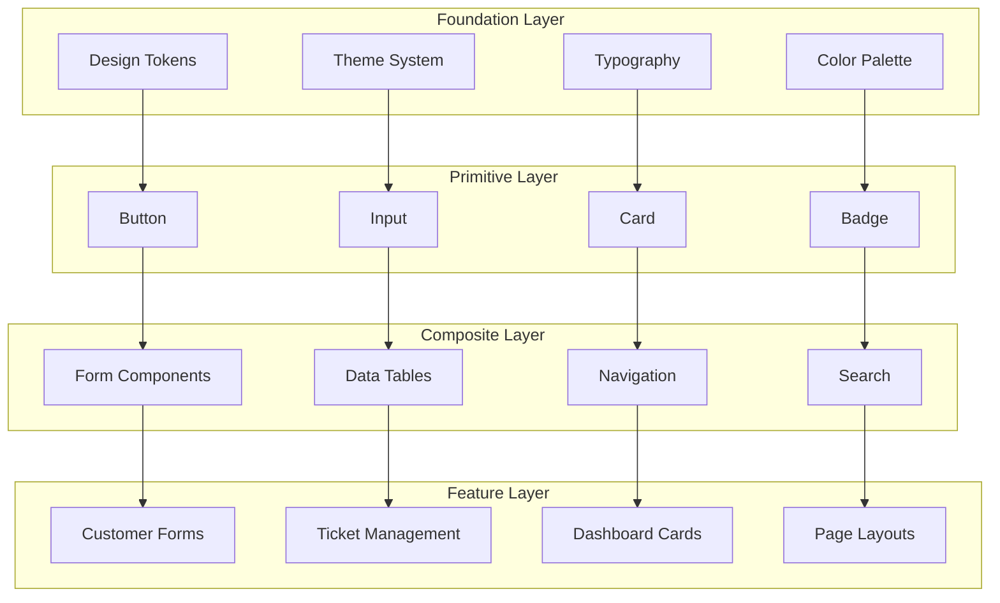

# 🎨 Component Design System - Francisco Computer Repair Shop

## 📋 Design System Overview

A comprehensive design system that provides consistency, reusability, and maintainability across the repair shop application. Built with modern web standards and accessibility in mind.

### 🎯 Design Principles
- **Consistency**: Unified visual language across all components
- **Accessibility**: WCAG 2.1 AA compliance minimum
- **Performance**: Optimized for speed and efficiency
- **Scalability**: Extensible architecture for future growth
- **Developer Experience**: Intuitive APIs and clear documentation

---

## 🏗️ Component Architecture

### **Design System Layers**


---

## 🎨 Design Tokens & Foundation

### **Color System**
```typescript
// Primary Brand Colors
export const colors = {
  primary: {
    50: '#eff6ff',
    100: '#dbeafe', 
    200: '#bfdbfe',
    300: '#93c5fd',
    400: '#60a5fa',
    500: '#3b82f6', // Primary blue
    600: '#2563eb',
    700: '#1d4ed8',
    800: '#1e40af',
    900: '#1e3a8a',
  },
  secondary: {
    50: '#faf5ff',
    100: '#f3e8ff',
    200: '#e9d5ff', 
    300: '#d8b4fe',
    400: '#c084fc',
    500: '#a855f7', // Primary purple
    600: '#9333ea',
    700: '#7c3aed',
    800: '#6b21a8',
    900: '#581c87',
  },
  // Semantic colors
  success: {
    500: '#10b981',
    600: '#059669',
  },
  warning: {
    500: '#f59e0b',
    600: '#d97706',
  },
  error: {
    500: '#ef4444',
    600: '#dc2626',
  },
  neutral: {
    50: '#f9fafb',
    100: '#f3f4f6',
    200: '#e5e7eb',
    300: '#d1d5db',
    400: '#9ca3af',
    500: '#6b7280',
    600: '#4b5563',
    700: '#374151',
    800: '#1f2937',
    900: '#111827',
  }
} as const;
```

### **Typography Scale**
```typescript
export const typography = {
  fontFamily: {
    sans: ['Inter', 'system-ui', 'sans-serif'],
    mono: ['JetBrains Mono', 'Consolas', 'monospace'],
  },
  fontSize: {
    xs: ['0.75rem', { lineHeight: '1rem' }],
    sm: ['0.875rem', { lineHeight: '1.25rem' }],
    base: ['1rem', { lineHeight: '1.5rem' }],
    lg: ['1.125rem', { lineHeight: '1.75rem' }],
    xl: ['1.25rem', { lineHeight: '1.75rem' }],
    '2xl': ['1.5rem', { lineHeight: '2rem' }],
    '3xl': ['1.875rem', { lineHeight: '2.25rem' }],
    '4xl': ['2.25rem', { lineHeight: '2.5rem' }],
    '5xl': ['3rem', { lineHeight: '1' }],
  },
  fontWeight: {
    normal: '400',
    medium: '500',
    semibold: '600', 
    bold: '700',
  }
} as const;
```

### **Spacing System**
```typescript
export const spacing = {
  0: '0px',
  1: '0.25rem',  // 4px
  2: '0.5rem',   // 8px
  3: '0.75rem',  // 12px
  4: '1rem',     // 16px
  5: '1.25rem',  // 20px
  6: '1.5rem',   // 24px
  8: '2rem',     // 32px
  10: '2.5rem',  // 40px
  12: '3rem',    // 48px
  16: '4rem',    // 64px
  20: '5rem',    // 80px
  24: '6rem',    // 96px
} as const;
```

### **Animation System**
```typescript
export const animations = {
  // Blob animations for backgrounds
  blob: {
    animation: 'blob 7s infinite',
    keyframes: {
      '0%': { transform: 'translate(0px, 0px) scale(1)' },
      '33%': { transform: 'translate(30px, -50px) scale(1.1)' },
      '66%': { transform: 'translate(-20px, 20px) scale(0.9)' },
      '100%': { transform: 'translate(0px, 0px) scale(1)' },
    }
  },
  // Standard transitions
  transition: {
    fast: '0.15s ease-out',
    base: '0.2s ease-out', 
    slow: '0.3s ease-out',
  },
  // Hover effects
  hover: {
    lift: 'transform 0.2s ease-out',
    scale: 'transform 0.15s ease-out',
    glow: 'box-shadow 0.2s ease-out',
  }
} as const;
```

---

## 🧱 Primitive Components

### **Button Component**
```typescript
interface ButtonProps extends React.ButtonHTMLAttributes<HTMLButtonElement> {
  variant?: 'default' | 'destructive' | 'outline' | 'secondary' | 'ghost' | 'link';
  size?: 'default' | 'sm' | 'lg' | 'icon';
  loading?: boolean;
  gradient?: boolean;
  icon?: React.ComponentType<{ className?: string }>;
  children: React.ReactNode;
}

// Usage Examples
<Button variant="default" size="lg" gradient>
  Create Customer
</Button>

<Button variant="outline" icon={SearchIcon}>
  Search
</Button>

<Button loading loadingText="Saving...">
  Save Changes
</Button>
```

**Button Variants:**
- `default`: Primary blue gradient background
- `destructive`: Red background for dangerous actions
- `outline`: Border with transparent background
- `secondary`: Muted background color
- `ghost`: Transparent with hover effects
- `link`: Text-only button styling

### **Input Component**
```typescript
interface InputProps extends React.InputHTMLAttributes<HTMLInputElement> {
  label?: string;
  error?: string;
  hint?: string;
  required?: boolean;
  icon?: React.ComponentType<{ className?: string }>;
  iconPosition?: 'left' | 'right';
}

// Usage Examples
<Input 
  label="Email Address"
  type="email"
  required
  icon={MailIcon}
  iconPosition="left"
  placeholder="customer@example.com"
/>

<Input 
  label="Phone Number"
  type="tel"
  error="Please enter a valid phone number"
  hint="Include country code if international"
/>
```

### **Card Component**
```typescript
interface CardProps {
  children: React.ReactNode;
  variant?: 'default' | 'elevated' | 'outlined';
  padding?: 'none' | 'sm' | 'md' | 'lg';
  hover?: boolean;
  gradient?: boolean;
  className?: string;
}

// Usage Examples
<Card variant="elevated" hover gradient>
  <Card.Header>
    <h3>Customer Details</h3>
  </Card.Header>
  <Card.Content>
    <p>Customer information content...</p>
  </Card.Content>
  <Card.Footer>
    <Button>Edit Customer</Button>
  </Card.Footer>
</Card>
```

### **Badge Component**
```typescript
interface BadgeProps {
  children: React.ReactNode;
  variant?: 'default' | 'success' | 'warning' | 'error' | 'secondary';
  size?: 'sm' | 'md' | 'lg';
  icon?: React.ComponentType<{ className?: string }>;
}

// Usage Examples
<Badge variant="success" icon={CheckIcon}>
  Completed
</Badge>

<Badge variant="warning">
  Pending
</Badge>
```

---

## 🔧 Composite Components

### **Form System Components**

#### **FormWrapper**
```typescript
interface FormWrapperProps {
  title: string;
  subtitle?: string;
  children: React.ReactNode;
  headerActions?: React.ReactNode;
  className?: string;
}

// Provides consistent form layout with gradient backgrounds
<FormWrapper 
  title="Edit Customer" 
  subtitle="Update customer information"
  headerActions={<Button variant="ghost">Cancel</Button>}
>
  <form>{/* Form content */}</form>
</FormWrapper>
```

#### **FormSection**
```typescript
interface FormSectionProps {
  title: string;
  description?: string;
  children: React.ReactNode;
  showDivider?: boolean;
}

// Groups related form fields with visual separation
<FormSection 
  title="Contact Information"
  description="How to reach the customer"
>
  <FormGrid columns={2}>
    <Input label="Email" />
    <Input label="Phone" />
  </FormGrid>
</FormSection>
```

#### **FormGrid**
```typescript
interface FormGridProps {
  children: React.ReactNode;
  columns?: 1 | 2 | 3 | 4;
  gap?: 'sm' | 'md' | 'lg';
  className?: string;
}

// Responsive grid layout for form fields
<FormGrid columns={2} gap="lg">
  <Input label="First Name" />
  <Input label="Last Name" />
</FormGrid>
```

#### **FormActions**
```typescript
interface FormActionsProps {
  submitText: string;
  submitLoadingText: string;
  isSubmitting: boolean;
  onReset?: () => void;
  resetText?: string;
  showReset?: boolean;
}

// Consistent form action buttons with gradient styling
<FormActions
  submitText="Create Customer"
  submitLoadingText="Creating..."
  isSubmitting={loading}
  onReset={handleReset}
/>
```

### **Data Display Components**

#### **DataTable**
```typescript
interface DataTableProps<T> {
  columns: ColumnDef<T>[];
  data: T[];
  loading?: boolean;
  pagination?: PaginationConfig;
  filtering?: FilterConfig;
  sorting?: SortConfig;
  selection?: SelectionConfig;
}

// Advanced data table with built-in features
<DataTable
  columns={customerColumns}
  data={customers}
  pagination={{ pageSize: 10 }}
  filtering={{ searchPlaceholder: "Search customers..." }}
  sorting={{ defaultSort: [{ id: 'lastName', desc: false }] }}
/>
```

#### **StatCard**
```typescript
interface StatCardProps {
  title: string;
  value: number | string;
  icon: React.ComponentType<{ className?: string }>;
  trend?: {
    value: number;
    direction: 'up' | 'down';
    period: string;
  };
  color?: 'blue' | 'green' | 'yellow' | 'red' | 'purple';
}

// Dashboard statistics with gradient styling
<StatCard
  title="Total Tickets"
  value={145}
  icon={FileTextIcon}
  trend={{ value: 12, direction: 'up', period: 'last month' }}
  color="blue"
/>
```

#### **SearchBar**
```typescript
interface SearchBarProps {
  placeholder?: string;
  value: string;
  onChange: (value: string) => void;
  onClear: () => void;
  loading?: boolean;
  suggestions?: string[];
  filters?: FilterOption[];
}

// Enhanced search with suggestions and filters
<SearchBar
  placeholder="Search tickets by ID, title, or description..."
  value={searchQuery}
  onChange={setSearchQuery}
  onClear={() => setSearchQuery('')}
  loading={searching}
  suggestions={recentSearches}
  filters={[
    { label: 'Status', options: ['All', 'Pending', 'Completed'] },
    { label: 'Technician', options: technicianList }
  ]}
/>
```

---

## 🎪 Feature Components

### **Customer Management**

#### **CustomerForm**
```typescript
interface CustomerFormProps {
  customer?: Customer;
  onSubmit: (data: CustomerFormData) => Promise<void>;
  onCancel?: () => void;
  loading?: boolean;
}

// Complete customer form with validation and sections
<CustomerForm
  customer={existingCustomer}
  onSubmit={handleSubmit}
  onCancel={() => router.back()}
  loading={isSubmitting}
/>
```

#### **CustomerTable**
```typescript  
interface CustomerTableProps {
  customers: Customer[];
  selectMode?: boolean;
  onSelect?: (customer: Customer) => void;
  loading?: boolean;
}

// Customer data table with selection capabilities
<CustomerTable
  customers={customerList}
  selectMode={true}
  onSelect={handleCustomerSelect}
  loading={loadingCustomers}
/>
```

### **Ticket Management**

#### **TicketForm**
```typescript
interface TicketFormProps {
  ticket?: Ticket;
  customerId?: number;
  onSubmit: (data: TicketFormData) => Promise<void>;
  loading?: boolean;
}

// Ticket creation/editing form
<TicketForm
  customerId={selectedCustomer.id}
  onSubmit={handleTicketSubmit}
  loading={isCreating}
/>
```

#### **TicketStatusBadge**
```typescript
interface TicketStatusBadgeProps {
  completed: boolean;
  size?: 'sm' | 'md' | 'lg';
  showIcon?: boolean;
}

// Status indicator with consistent styling
<TicketStatusBadge 
  completed={ticket.completed}
  size="md"
  showIcon={true}
/>
```

### **Navigation Components**

#### **Header**
```typescript
interface HeaderProps {
  user: User;
  onLogout: () => void;
}

// Main application header with navigation
<Header user={currentUser} onLogout={handleLogout} />
```

#### **NavButton**
```typescript
interface NavButtonProps {
  Icon: React.ComponentType<{ className?: string }>;
  href: string;
  label: string;
  active?: boolean;
}

// Navigation button with active state
<NavButton
  Icon={UsersIcon}
  href="/customers"
  label="Customers"
  active={pathname === '/customers'}
/>
```

---

## 🎯 Component Usage Guidelines

### **Composition Patterns**

#### **Page Layout Pattern**
```typescript
function CustomersPage() {
  return (
    <PageLayout>
      <PageLayout.Header>
        <PageTitle>Customers</PageTitle>
        <PageActions>
          <Button href="/customers/new">Add Customer</Button>
        </PageActions>
      </PageLayout.Header>
      
      <PageLayout.Content>
        <SearchSection>
          <SearchBar {...searchProps} />
        </SearchSection>
        
        <StatsSection>
          <StatCard title="Total" value={totalCustomers} />
          <StatCard title="Active" value={activeCustomers} />
        </StatsSection>
        
        <DataSection>
          <CustomerTable customers={customers} />
        </DataSection>
      </PageLayout.Content>
    </PageLayout>
  );
}
```

#### **Form Layout Pattern**
```typescript
function CustomerFormPage() {
  return (
    <FormWrapper title="New Customer" subtitle="Create customer record">
      <Form onSubmit={handleSubmit}>
        <FormSection title="Personal Information">
          <FormGrid columns={2}>
            <Input name="firstName" label="First Name" required />
            <Input name="lastName" label="Last Name" required />
          </FormGrid>
        </FormSection>
        
        <FormSection title="Contact Information">
          <FormGrid columns={2}>
            <Input name="email" type="email" label="Email" required />
            <Input name="phone" type="tel" label="Phone" required />
          </FormGrid>
        </FormSection>
        
        <FormActions
          submitText="Create Customer"
          submitLoadingText="Creating..."
          isSubmitting={isSubmitting}
        />
      </Form>
    </FormWrapper>
  );
}
```

### **Accessibility Guidelines**

#### **Keyboard Navigation**
- All interactive elements must be keyboard accessible
- Logical tab order throughout the interface
- Visible focus indicators with high contrast
- Skip links for main content areas

#### **Screen Reader Support**
```typescript
// Proper ARIA labels and descriptions
<Button 
  aria-label="Delete customer John Doe"
  aria-describedby="delete-warning"
>
  <TrashIcon />
</Button>
<div id="delete-warning" className="sr-only">
  This action cannot be undone
</div>

// Live regions for dynamic content
<div aria-live="polite" aria-atomic="true">
  {searchResults.length} customers found
</div>
```

#### **Color and Contrast**
- Minimum 4.5:1 contrast ratio for normal text
- Minimum 3:1 contrast ratio for large text
- Color is not the only means of conveying information
- High contrast mode support

### **Performance Optimization**

#### **Code Splitting**
```typescript
// Lazy load heavy components
const CustomerForm = lazy(() => import('./CustomerForm'));
const TicketTable = lazy(() => import('./TicketTable'));

// Use Suspense for loading boundaries
<Suspense fallback={<FormSkeleton />}>
  <CustomerForm />
</Suspense>
```

#### **Memoization**
```typescript
// Memo for expensive calculations
const MemoizedCustomerTable = memo(CustomerTable, (prevProps, nextProps) => {
  return prevProps.customers === nextProps.customers &&
         prevProps.loading === nextProps.loading;
});

// useMemo for derived state
const filteredCustomers = useMemo(() => {
  return customers.filter(customer => 
    customer.name.toLowerCase().includes(searchQuery.toLowerCase())
  );
}, [customers, searchQuery]);
```

---

## 🔧 Development Tools & Workflow

### **Storybook Integration**
```typescript
// Component stories for documentation and testing
export default {
  title: 'Components/Button',
  component: Button,
  parameters: {
    docs: {
      description: {
        component: 'Primary button component with multiple variants'
      }
    }
  }
} as Meta<typeof Button>;

export const Default: Story = {
  args: {
    children: 'Button Text',
    variant: 'default'
  }
};

export const WithGradient: Story = {
  args: {
    children: 'Gradient Button',
    variant: 'default',
    gradient: true
  }
};
```

### **Design Token Generation**
```typescript
// Automated token generation from design files
const designTokens = generateTokens({
  source: './design-tokens.json',
  output: './src/styles/tokens.ts',
  format: 'typescript'
});

// CSS custom properties generation
const cssTokens = generateCSS({
  tokens: designTokens,
  output: './src/styles/tokens.css'
});
```

### **Component Testing**
```typescript
// Comprehensive component testing
describe('Button Component', () => {
  it('renders with correct variant styles', () => {
    render(<Button variant="default">Test</Button>);
    expect(screen.getByRole('button')).toHaveClass('bg-gradient-to-r');
  });
  
  it('handles loading state correctly', () => {
    render(<Button loading>Loading</Button>);
    expect(screen.getByRole('button')).toBeDisabled();
    expect(screen.getByText('Loading')).toBeInTheDocument();
  });
  
  it('supports keyboard navigation', () => {
    const handleClick = jest.fn();
    render(<Button onClick={handleClick}>Test</Button>);
    fireEvent.keyDown(screen.getByRole('button'), { key: 'Enter' });
    expect(handleClick).toHaveBeenCalled();
  });
});
```

---

## 📚 Documentation & Maintenance

### **Component Documentation Standards**
- Comprehensive TypeScript interfaces
- Usage examples with common scenarios
- Accessibility notes and ARIA patterns
- Performance considerations and best practices
- Visual regression testing with screenshots

### **Version Management**
- Semantic versioning for component library
- Breaking change documentation
- Migration guides for major updates
- Deprecation warnings and timelines

### **Quality Assurance**
- Automated visual regression testing
- Cross-browser compatibility testing
- Performance benchmarking
- Accessibility audit integration
- Design system consistency validation

---

*This design system serves as the foundation for building consistent, accessible, and performant user interfaces across the Francisco Computer Repair Shop application. Regular updates ensure alignment with evolving design standards and user needs.*