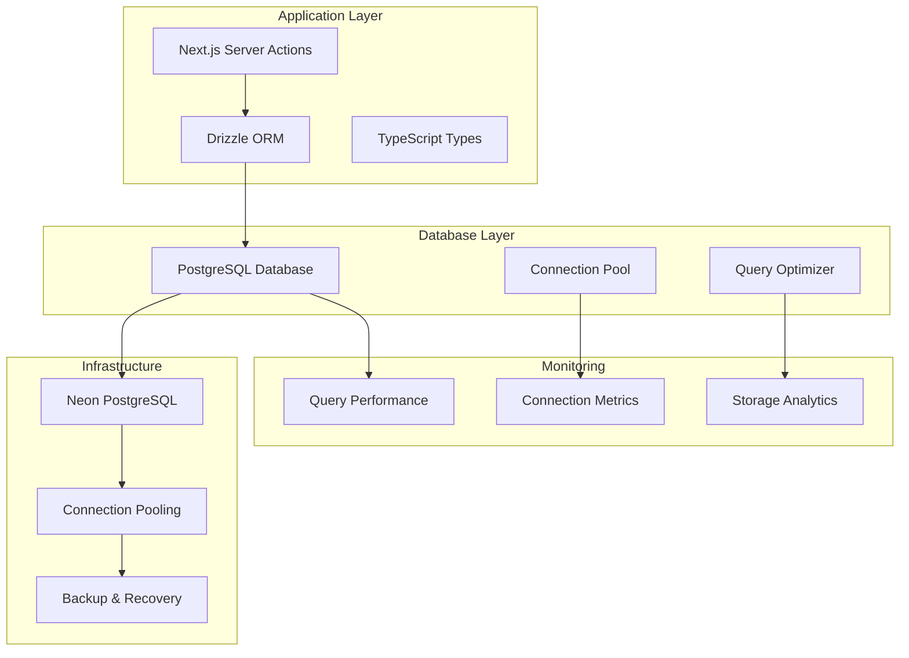
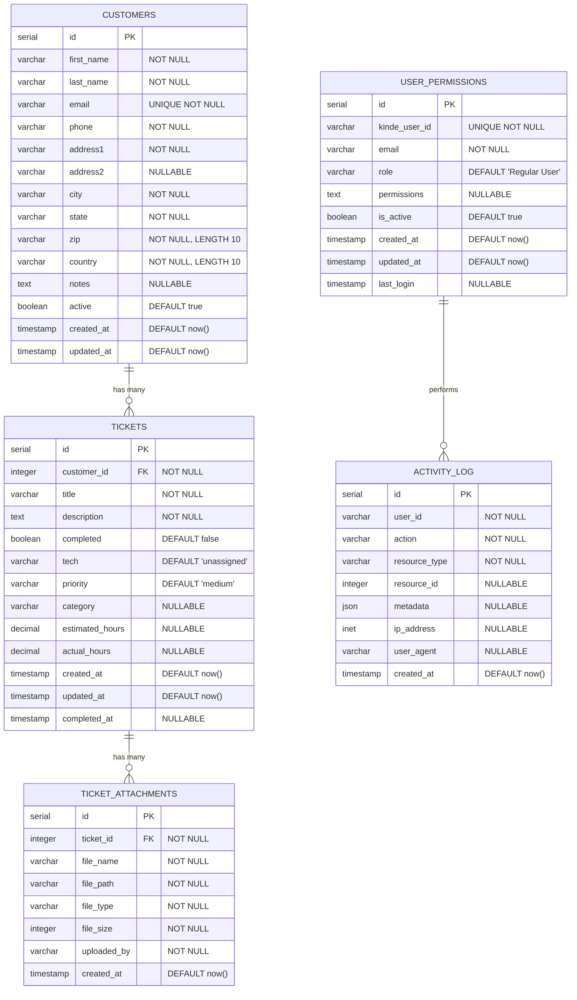

# 🗄️ Database Design & Schema - Francisco Computer Repair Shop

## 📋 Database Overview

Comprehensive database design for the Computer Repair Shop management system, built on PostgreSQL with Drizzle ORM, featuring optimized schemas, relationships, indexes, and performance considerations.

### 🎯 Design Principles
- **Data Integrity**: Enforced through constraints and relationships
- **Performance**: Optimized indexes and query patterns
- **Scalability**: Designed for growth and high transaction volumes
- **Security**: Role-based access and audit trails
- **Maintainability**: Clear structure and comprehensive documentation

---

## 🏗️ Database Architecture

### **Technology Stack**


### **Entity Relationship Diagram**


---

## 📊 Core Tables

### **Customers Table**
```sql
CREATE TABLE customers (
    id SERIAL PRIMARY KEY,
    first_name VARCHAR(255) NOT NULL,
    last_name VARCHAR(255) NOT NULL,
    email VARCHAR(255) NOT NULL UNIQUE,
    phone VARCHAR(255) NOT NULL,
    address1 VARCHAR(255) NOT NULL,
    address2 VARCHAR(255),
    city VARCHAR(255) NOT NULL,
    state VARCHAR(255) NOT NULL,
    zip VARCHAR(10) NOT NULL,
    country VARCHAR(10) NOT NULL DEFAULT 'US',
    notes TEXT,
    active BOOLEAN NOT NULL DEFAULT true,
    created_at TIMESTAMP NOT NULL DEFAULT CURRENT_TIMESTAMP,
    updated_at TIMESTAMP NOT NULL DEFAULT CURRENT_TIMESTAMP,
    
    -- Constraints
    CHECK (LENGTH(first_name) >= 1),
    CHECK (LENGTH(last_name) >= 1),
    CHECK (email ~* '^[A-Za-z0-9._%+-]+@[A-Za-z0-9.-]+\.[A-Za-z]{2,}$'),
    CHECK (LENGTH(zip) BETWEEN 5 AND 10)
);

-- Indexes for performance optimization
CREATE INDEX customers_email_idx ON customers(email);
CREATE INDEX customers_active_idx ON customers(active);
CREATE INDEX customers_name_idx ON customers(last_name, first_name);
CREATE INDEX customers_created_at_idx ON customers(created_at);

-- Full-text search index
CREATE INDEX customers_search_idx ON customers 
USING gin(to_tsvector('english', first_name || ' ' || last_name || ' ' || email));

-- Trigger for updated_at
CREATE OR REPLACE FUNCTION update_updated_at_column()
RETURNS TRIGGER AS $$
BEGIN
    NEW.updated_at = CURRENT_TIMESTAMP;
    RETURN NEW;
END;
$$ language 'plpgsql';

CREATE TRIGGER update_customers_updated_at 
    BEFORE UPDATE ON customers 
    FOR EACH ROW 
    EXECUTE FUNCTION update_updated_at_column();
```

**Drizzle Schema Definition:**
```typescript
export const customers = pgTable("customers", {
    id: serial("id").primaryKey(),
    firstName: varchar("first_name", { length: 255 }).notNull(),
    lastName: varchar("last_name", { length: 255 }).notNull(),
    email: varchar("email", { length: 255 }).notNull().unique(),
    phone: varchar("phone", { length: 255 }).notNull(),
    address1: varchar("address1", { length: 255 }).notNull(),
    address2: varchar("address2", { length: 255 }),
    city: varchar("city", { length: 255 }).notNull(),
    state: varchar("state", { length: 255 }).notNull(),
    zip: varchar("zip", { length: 10 }).notNull(),
    country: varchar("country", { length: 10 }).notNull().default('US'),
    notes: text("notes"),
    active: boolean("active").notNull().default(true),
    createdAt: timestamp("created_at").notNull().defaultNow(),
    updatedAt: timestamp("updated_at").notNull().defaultNow().$onUpdate(() => new Date()),
}, (table) => ({
    emailIdx: index("customers_email_idx").on(table.email),
    activeIdx: index("customers_active_idx").on(table.active),
    nameIdx: index("customers_name_idx").on(table.lastName, table.firstName),
    createdAtIdx: index("customers_created_at_idx").on(table.createdAt),
}));

export type Customer = InferSelectModel<typeof customers>;
export type NewCustomer = InferInsertModel<typeof customers>;
```

### **Tickets Table**
```sql
CREATE TABLE tickets (
    id SERIAL PRIMARY KEY,
    customer_id INTEGER NOT NULL REFERENCES customers(id) ON DELETE CASCADE,
    title VARCHAR(255) NOT NULL,
    description TEXT NOT NULL,
    completed BOOLEAN NOT NULL DEFAULT false,
    tech VARCHAR(255) NOT NULL DEFAULT 'unassigned',
    priority VARCHAR(20) NOT NULL DEFAULT 'medium' CHECK (priority IN ('low', 'medium', 'high', 'urgent')),
    category VARCHAR(100),
    estimated_hours DECIMAL(5,2),
    actual_hours DECIMAL(5,2),
    created_at TIMESTAMP NOT NULL DEFAULT CURRENT_TIMESTAMP,
    updated_at TIMESTAMP NOT NULL DEFAULT CURRENT_TIMESTAMP,
    completed_at TIMESTAMP,
    
    -- Constraints
    CHECK (LENGTH(title) >= 1),
    CHECK (LENGTH(description) >= 1),
    CHECK (estimated_hours IS NULL OR estimated_hours > 0),
    CHECK (actual_hours IS NULL OR actual_hours > 0),
    CHECK (completed_at IS NULL OR completed = true)
);

-- Performance indexes
CREATE INDEX tickets_customer_id_idx ON tickets(customer_id);
CREATE INDEX tickets_completed_idx ON tickets(completed);
CREATE INDEX tickets_tech_idx ON tickets(tech);
CREATE INDEX tickets_priority_idx ON tickets(priority);
CREATE INDEX tickets_created_at_idx ON tickets(created_at);
CREATE INDEX tickets_status_tech_idx ON tickets(completed, tech); -- Composite index

-- Full-text search for tickets
CREATE INDEX tickets_search_idx ON tickets 
USING gin(to_tsvector('english', title || ' ' || description));

-- Trigger for completed_at timestamp
CREATE OR REPLACE FUNCTION update_ticket_completed_at()
RETURNS TRIGGER AS $$
BEGIN
    IF NEW.completed = true AND OLD.completed = false THEN
        NEW.completed_at = CURRENT_TIMESTAMP;
    ELSIF NEW.completed = false AND OLD.completed = true THEN
        NEW.completed_at = NULL;
    END IF;
    
    NEW.updated_at = CURRENT_TIMESTAMP;
    RETURN NEW;
END;
$$ language 'plpgsql';

CREATE TRIGGER update_tickets_completed_at 
    BEFORE UPDATE ON tickets 
    FOR EACH ROW 
    EXECUTE FUNCTION update_ticket_completed_at();
```

**Drizzle Schema Definition:**
```typescript
export const tickets = pgTable("tickets", {
    id: serial("id").primaryKey(),
    customerId: integer("customer_id").notNull().references(() => customers.id, { onDelete: "cascade" }),
    title: varchar("title", { length: 255 }).notNull(),
    description: text("description").notNull(),
    completed: boolean("completed").notNull().default(false),
    tech: varchar("tech", { length: 255 }).notNull().default("unassigned"),
    priority: varchar("priority", { length: 20 }).notNull().default("medium"),
    category: varchar("category", { length: 100 }),
    estimatedHours: decimal("estimated_hours", { precision: 5, scale: 2 }),
    actualHours: decimal("actual_hours", { precision: 5, scale: 2 }),
    createdAt: timestamp("created_at").notNull().defaultNow(),
    updatedAt: timestamp("updated_at").notNull().defaultNow().$onUpdate(() => new Date()),
    completedAt: timestamp("completed_at"),
}, (table) => ({
    customerIdIdx: index("tickets_customer_id_idx").on(table.customerId),
    completedIdx: index("tickets_completed_idx").on(table.completed),
    techIdx: index("tickets_tech_idx").on(table.tech),
    priorityIdx: index("tickets_priority_idx").on(table.priority),
    createdAtIdx: index("tickets_created_at_idx").on(table.createdAt),
    statusTechIdx: index("tickets_status_tech_idx").on(table.completed, table.tech),
}));

export type Ticket = InferSelectModel<typeof tickets>;
export type NewTicket = InferInsertModel<typeof tickets>;
```

### **User Permissions Table**
```sql
CREATE TABLE user_permissions (
    id SERIAL PRIMARY KEY,
    kinde_user_id VARCHAR(255) NOT NULL UNIQUE,
    email VARCHAR(255) NOT NULL,
    role VARCHAR(50) NOT NULL DEFAULT 'Regular User' CHECK (role IN ('Manager', 'Technician', 'Regular User', 'Viewer')),
    permissions TEXT, -- JSON array of permissions
    is_active BOOLEAN NOT NULL DEFAULT true,
    created_at TIMESTAMP NOT NULL DEFAULT CURRENT_TIMESTAMP,
    updated_at TIMESTAMP NOT NULL DEFAULT CURRENT_TIMESTAMP,
    last_login TIMESTAMP,
    
    -- Constraints
    CHECK (email ~* '^[A-Za-z0-9._%+-]+@[A-Za-z0-9.-]+\.[A-Za-z]{2,}$')
);

-- Indexes
CREATE INDEX user_permissions_kinde_user_id_idx ON user_permissions(kinde_user_id);
CREATE INDEX user_permissions_email_idx ON user_permissions(email);
CREATE INDEX user_permissions_role_idx ON user_permissions(role);
CREATE INDEX user_permissions_active_idx ON user_permissions(is_active);

-- Trigger for updated_at
CREATE TRIGGER update_user_permissions_updated_at 
    BEFORE UPDATE ON user_permissions 
    FOR EACH ROW 
    EXECUTE FUNCTION update_updated_at_column();
```

---

## 🔗 Extended Tables

### **Ticket Attachments Table**
```sql
CREATE TABLE ticket_attachments (
    id SERIAL PRIMARY KEY,
    ticket_id INTEGER NOT NULL REFERENCES tickets(id) ON DELETE CASCADE,
    file_name VARCHAR(255) NOT NULL,
    file_path VARCHAR(500) NOT NULL,
    file_type VARCHAR(100) NOT NULL,
    file_size INTEGER NOT NULL CHECK (file_size > 0),
    uploaded_by VARCHAR(255) NOT NULL,
    created_at TIMESTAMP NOT NULL DEFAULT CURRENT_TIMESTAMP,
    
    -- Constraints
    CHECK (LENGTH(file_name) >= 1),
    CHECK (file_size <= 50 * 1024 * 1024) -- 50MB limit
);

-- Indexes
CREATE INDEX ticket_attachments_ticket_id_idx ON ticket_attachments(ticket_id);
CREATE INDEX ticket_attachments_uploaded_by_idx ON ticket_attachments(uploaded_by);
CREATE INDEX ticket_attachments_created_at_idx ON ticket_attachments(created_at);
```

**Drizzle Schema:**
```typescript
export const ticketAttachments = pgTable("ticket_attachments", {
    id: serial("id").primaryKey(),
    ticketId: integer("ticket_id").notNull().references(() => tickets.id, { onDelete: "cascade" }),
    fileName: varchar("file_name", { length: 255 }).notNull(),
    filePath: varchar("file_path", { length: 500 }).notNull(),
    fileType: varchar("file_type", { length: 100 }).notNull(),
    fileSize: integer("file_size").notNull(),
    uploadedBy: varchar("uploaded_by", { length: 255 }).notNull(),
    createdAt: timestamp("created_at").notNull().defaultNow(),
}, (table) => ({
    ticketIdIdx: index("ticket_attachments_ticket_id_idx").on(table.ticketId),
    uploadedByIdx: index("ticket_attachments_uploaded_by_idx").on(table.uploadedBy),
}));
```

### **Activity Log Table**
```sql
CREATE TABLE activity_log (
    id SERIAL PRIMARY KEY,
    user_id VARCHAR(255) NOT NULL,
    action VARCHAR(100) NOT NULL,
    resource_type VARCHAR(50) NOT NULL,
    resource_id INTEGER,
    metadata JSONB,
    ip_address INET,
    user_agent TEXT,
    created_at TIMESTAMP NOT NULL DEFAULT CURRENT_TIMESTAMP,
    
    -- Constraints
    CHECK (LENGTH(action) >= 1),
    CHECK (resource_type IN ('customer', 'ticket', 'user', 'system'))
);

-- Indexes for performance
CREATE INDEX activity_log_user_id_idx ON activity_log(user_id);
CREATE INDEX activity_log_action_idx ON activity_log(action);
CREATE INDEX activity_log_resource_idx ON activity_log(resource_type, resource_id);
CREATE INDEX activity_log_created_at_idx ON activity_log(created_at);

-- GIN index for JSONB metadata
CREATE INDEX activity_log_metadata_idx ON activity_log USING gin(metadata);

-- Partition by month for performance
CREATE TABLE activity_log_y2024m01 PARTITION OF activity_log
FOR VALUES FROM ('2024-01-01') TO ('2024-02-01');
```

---

## 🔍 Advanced Database Features

### **Views for Common Queries**

#### **Customer Summary View**
```sql
CREATE VIEW customer_summary AS
SELECT 
    c.id,
    c.first_name,
    c.last_name,
    c.email,
    c.phone,
    c.active,
    c.created_at,
    COUNT(t.id) as total_tickets,
    COUNT(CASE WHEN t.completed = false THEN 1 END) as open_tickets,
    COUNT(CASE WHEN t.completed = true THEN 1 END) as completed_tickets,
    MAX(t.created_at) as last_ticket_date,
    COALESCE(SUM(t.actual_hours), 0) as total_hours_billed
FROM customers c
LEFT JOIN tickets t ON c.id = t.customer_id
WHERE c.active = true
GROUP BY c.id, c.first_name, c.last_name, c.email, c.phone, c.active, c.created_at;

-- Index on the view
CREATE INDEX customer_summary_total_tickets_idx ON customer_summary(total_tickets);
```

#### **Technician Performance View**
```sql
CREATE VIEW technician_performance AS
SELECT 
    tech,
    COUNT(*) as total_tickets,
    COUNT(CASE WHEN completed = true THEN 1 END) as completed_tickets,
    COUNT(CASE WHEN completed = false THEN 1 END) as open_tickets,
    ROUND(
        COUNT(CASE WHEN completed = true THEN 1 END) * 100.0 / COUNT(*), 2
    ) as completion_rate,
    AVG(CASE WHEN completed = true AND actual_hours IS NOT NULL 
        THEN actual_hours END) as avg_hours_per_ticket,
    AVG(CASE WHEN completed = true 
        THEN EXTRACT(EPOCH FROM (completed_at - created_at)) / 3600 
        END) as avg_completion_time_hours
FROM tickets
WHERE tech != 'unassigned'
    AND created_at >= CURRENT_DATE - INTERVAL '30 days'
GROUP BY tech
HAVING COUNT(*) > 0;
```

### **Stored Procedures**

#### **Customer Deactivation Procedure**
```sql
CREATE OR REPLACE FUNCTION deactivate_customer(customer_id INTEGER)
RETURNS TABLE(success BOOLEAN, message TEXT) AS $$
DECLARE
    open_tickets_count INTEGER;
BEGIN
    -- Check for open tickets
    SELECT COUNT(*) INTO open_tickets_count
    FROM tickets 
    WHERE customer_id = deactivate_customer.customer_id 
        AND completed = false;
    
    IF open_tickets_count > 0 THEN
        RETURN QUERY SELECT false, 'Cannot deactivate customer with open tickets: ' || open_tickets_count;
        RETURN;
    END IF;
    
    -- Deactivate customer
    UPDATE customers 
    SET active = false, updated_at = CURRENT_TIMESTAMP
    WHERE id = customer_id;
    
    IF FOUND THEN
        RETURN QUERY SELECT true, 'Customer deactivated successfully';
    ELSE
        RETURN QUERY SELECT false, 'Customer not found';
    END IF;
END;
$$ LANGUAGE plpgsql;
```

#### **Auto-assign Ticket Procedure**
```sql
CREATE OR REPLACE FUNCTION auto_assign_ticket(ticket_id INTEGER)
RETURNS VARCHAR(255) AS $$
DECLARE
    assigned_tech VARCHAR(255);
BEGIN
    -- Find technician with least open tickets
    SELECT tech INTO assigned_tech
    FROM (
        SELECT 
            up.email as tech,
            COUNT(t.id) as open_tickets
        FROM user_permissions up
        LEFT JOIN tickets t ON up.email = t.tech AND t.completed = false
        WHERE up.role = 'Technician' 
            AND up.is_active = true
        GROUP BY up.email
        ORDER BY COUNT(t.id), RANDOM()
        LIMIT 1
    ) tech_workload;
    
    -- Assign ticket
    UPDATE tickets 
    SET tech = assigned_tech, updated_at = CURRENT_TIMESTAMP
    WHERE id = ticket_id;
    
    RETURN assigned_tech;
END;
$$ LANGUAGE plpgsql;
```

### **Database Functions**

#### **Search Functions**
```sql
-- Full-text search for customers
CREATE OR REPLACE FUNCTION search_customers(search_term TEXT)
RETURNS TABLE(
    id INTEGER,
    first_name VARCHAR(255),
    last_name VARCHAR(255),
    email VARCHAR(255),
    phone VARCHAR(255),
    rank REAL
) AS $$
BEGIN
    RETURN QUERY
    SELECT 
        c.id,
        c.first_name,
        c.last_name,
        c.email,
        c.phone,
        ts_rank(to_tsvector('english', c.first_name || ' ' || c.last_name || ' ' || c.email), 
                plainto_tsquery('english', search_term)) as rank
    FROM customers c
    WHERE c.active = true
        AND (
            to_tsvector('english', c.first_name || ' ' || c.last_name || ' ' || c.email) 
            @@ plainto_tsquery('english', search_term)
            OR c.phone ILIKE '%' || search_term || '%'
        )
    ORDER BY rank DESC, c.last_name, c.first_name
    LIMIT 50;
END;
$$ LANGUAGE plpgsql;
```

---

## 📈 Performance Optimization

### **Query Optimization Strategies**

#### **1. Index Usage Analysis**
```sql
-- Check index usage
SELECT 
    schemaname,
    tablename,
    indexname,
    idx_tup_read,
    idx_tup_fetch,
    idx_scan
FROM pg_stat_user_indexes
WHERE schemaname = 'public'
ORDER BY idx_scan DESC;

-- Find unused indexes
SELECT 
    schemaname,
    tablename,
    indexname,
    idx_scan,
    pg_size_pretty(pg_relation_size(indexrelid)) as size
FROM pg_stat_user_indexes
WHERE idx_scan = 0
    AND schemaname = 'public';
```

#### **2. Query Performance Monitoring**
```sql
-- Enable query logging for slow queries
ALTER SYSTEM SET log_min_duration_statement = 1000; -- Log queries > 1 second
ALTER SYSTEM SET log_statement_stats = on;

-- Create performance monitoring view
CREATE VIEW slow_queries AS
SELECT 
    query,
    calls,
    total_time,
    mean_time,
    rows,
    100.0 * shared_blks_hit / nullif(shared_blks_hit + shared_blks_read, 0) AS hit_percent
FROM pg_stat_statements
WHERE mean_time > 100 -- Queries averaging > 100ms
ORDER BY total_time DESC;
```

#### **3. Connection Pooling Configuration**
```typescript
// Database connection configuration for optimal performance
interface DatabaseConfig {
  host: string;
  port: number;
  database: string;
  username: string;
  password: string;
  ssl: boolean;
  
  // Connection pool settings
  pool: {
    min: number;          // Minimum connections: 2
    max: number;          // Maximum connections: 20
    idleTimeoutMillis: number;    // 30 seconds
    connectionTimeoutMillis: number; // 10 seconds
    acquireTimeoutMillis: number;    // 60 seconds
  };
  
  // Performance settings
  statement_timeout: string;    // '30s'
  query_timeout: number;        // 30000 ms
  
  // Logging
  logging: {
    slow_query_threshold: number; // 1000 ms
    log_queries: boolean;         // false in production
  };
}

export const dbConfig: DatabaseConfig = {
  host: process.env.DATABASE_HOST,
  port: parseInt(process.env.DATABASE_PORT || '5432'),
  database: process.env.DATABASE_NAME,
  username: process.env.DATABASE_USERNAME,
  password: process.env.DATABASE_PASSWORD,
  ssl: process.env.NODE_ENV === 'production',
  
  pool: {
    min: 2,
    max: 20,
    idleTimeoutMillis: 30000,
    connectionTimeoutMillis: 10000,
    acquireTimeoutMillis: 60000,
  },
  
  statement_timeout: '30s',
  query_timeout: 30000,
  
  logging: {
    slow_query_threshold: 1000,
    log_queries: process.env.NODE_ENV === 'development',
  }
};
```

### **Caching Strategies**

#### **1. Application-Level Caching**
```typescript
interface CacheConfig {
  customers: {
    ttl: 300000;      // 5 minutes
    maxSize: 1000;    // Max cached customers
  };
  tickets: {
    ttl: 60000;       // 1 minute
    maxSize: 5000;    // Max cached tickets
  };
  userPermissions: {
    ttl: 3600000;     // 1 hour
    maxSize: 100;     // Max cached users
  };
}

class DatabaseCache {
  private cache = new Map<string, { data: any; expires: number }>();
  
  get<T>(key: string): T | null {
    const cached = this.cache.get(key);
    if (!cached) return null;
    
    if (Date.now() > cached.expires) {
      this.cache.delete(key);
      return null;
    }
    
    return cached.data;
  }
  
  set<T>(key: string, data: T, ttl: number): void {
    this.cache.set(key, {
      data,
      expires: Date.now() + ttl
    });
  }
  
  invalidate(pattern: string): void {
    for (const key of this.cache.keys()) {
      if (key.includes(pattern)) {
        this.cache.delete(key);
      }
    }
  }
}
```

#### **2. Database-Level Caching**
```sql
-- Enable PostgreSQL query plan caching
ALTER SYSTEM SET shared_preload_libraries = 'pg_stat_statements';
ALTER SYSTEM SET pg_stat_statements.track = 'all';

-- Configure work memory for sorting and hashing
ALTER SYSTEM SET work_mem = '4MB';
ALTER SYSTEM SET maintenance_work_mem = '64MB';

-- Configure buffer cache
ALTER SYSTEM SET shared_buffers = '256MB';
ALTER SYSTEM SET effective_cache_size = '1GB';
```

---

## 🔒 Security & Compliance

### **Row-Level Security (RLS)**
```sql
-- Enable RLS on sensitive tables
ALTER TABLE customers ENABLE ROW LEVEL SECURITY;
ALTER TABLE tickets ENABLE ROW LEVEL SECURITY;
ALTER TABLE user_permissions ENABLE ROW LEVEL SECURITY;

-- Customers policy: Users can only see active customers
CREATE POLICY customers_policy ON customers
    FOR ALL
    TO authenticated_users
    USING (active = true);

-- Tickets policy: Regular users see only their assigned tickets
CREATE POLICY tickets_policy ON tickets
    FOR ALL
    TO authenticated_users
    USING (
        tech = current_setting('app.current_user_email')
        OR current_setting('app.user_role') = 'Manager'
    );

-- Managers can see all tickets
CREATE POLICY tickets_manager_policy ON tickets
    FOR ALL
    TO authenticated_users
    USING (current_setting('app.user_role') = 'Manager');
```

### **Data Encryption**
```sql
-- Encrypt sensitive data at rest
CREATE EXTENSION IF NOT EXISTS pgcrypto;

-- Function to encrypt sensitive data
CREATE OR REPLACE FUNCTION encrypt_sensitive_data(data TEXT)
RETURNS TEXT AS $$
BEGIN
    RETURN encode(
        encrypt(data::bytea, current_setting('app.encryption_key')::bytea, 'aes'),
        'base64'
    );
END;
$$ LANGUAGE plpgsql SECURITY DEFINER;

-- Function to decrypt sensitive data
CREATE OR REPLACE FUNCTION decrypt_sensitive_data(encrypted_data TEXT)
RETURNS TEXT AS $$
BEGIN
    RETURN convert_from(
        decrypt(decode(encrypted_data, 'base64'), current_setting('app.encryption_key')::bytea, 'aes'),
        'utf8'
    );
END;
$$ LANGUAGE plpgsql SECURITY DEFINER;
```

### **Audit Trail**
```sql
-- Audit trigger function
CREATE OR REPLACE FUNCTION audit_trigger()
RETURNS TRIGGER AS $$
BEGIN
    INSERT INTO activity_log (
        user_id,
        action,
        resource_type,
        resource_id,
        metadata,
        ip_address
    ) VALUES (
        current_setting('app.current_user_id'),
        TG_OP,
        TG_TABLE_NAME,
        COALESCE(NEW.id, OLD.id),
        jsonb_build_object(
            'old', row_to_json(OLD),
            'new', row_to_json(NEW)
        ),
        inet(current_setting('app.client_ip', true))
    );
    
    RETURN COALESCE(NEW, OLD);
END;
$$ LANGUAGE plpgsql;

-- Apply audit triggers
CREATE TRIGGER customers_audit_trigger
    AFTER INSERT OR UPDATE OR DELETE ON customers
    FOR EACH ROW EXECUTE FUNCTION audit_trigger();

CREATE TRIGGER tickets_audit_trigger
    AFTER INSERT OR UPDATE OR DELETE ON tickets
    FOR EACH ROW EXECUTE FUNCTION audit_trigger();
```

---

## 🧪 Testing & Maintenance

### **Database Testing Strategy**
```sql
-- Create test schema
CREATE SCHEMA IF NOT EXISTS test;

-- Test data factory
CREATE OR REPLACE FUNCTION create_test_customer(
    p_first_name VARCHAR DEFAULT 'Test',
    p_last_name VARCHAR DEFAULT 'Customer',
    p_email VARCHAR DEFAULT 'test@example.com'
)
RETURNS INTEGER AS $$
DECLARE
    customer_id INTEGER;
BEGIN
    INSERT INTO customers (first_name, last_name, email, phone, address1, city, state, zip, country)
    VALUES (p_first_name, p_last_name, p_email, '555-0123', '123 Test St', 'Test City', 'CA', '90210', 'US')
    RETURNING id INTO customer_id;
    
    RETURN customer_id;
END;
$$ LANGUAGE plpgsql;

-- Performance testing
CREATE OR REPLACE FUNCTION test_query_performance()
RETURNS TABLE(query_name TEXT, execution_time NUMERIC) AS $$
DECLARE
    start_time TIMESTAMP;
    end_time TIMESTAMP;
BEGIN
    -- Test customer search performance
    start_time := clock_timestamp();
    PERFORM * FROM customers WHERE email ILIKE '%test%' LIMIT 100;
    end_time := clock_timestamp();
    
    RETURN QUERY SELECT 'customer_search', EXTRACT(MILLISECONDS FROM end_time - start_time);
    
    -- Test ticket listing performance
    start_time := clock_timestamp();
    PERFORM * FROM tickets t 
    JOIN customers c ON t.customer_id = c.id 
    WHERE t.completed = false 
    ORDER BY t.created_at DESC 
    LIMIT 50;
    end_time := clock_timestamp();
    
    RETURN QUERY SELECT 'ticket_listing', EXTRACT(MILLISECONDS FROM end_time - start_time);
END;
$$ LANGUAGE plpgsql;
```

### **Maintenance Procedures**
```sql
-- Database maintenance function
CREATE OR REPLACE FUNCTION perform_maintenance()
RETURNS TEXT AS $$
DECLARE
    result TEXT := '';
BEGIN
    -- Update statistics
    ANALYZE customers;
    ANALYZE tickets;
    result := result || 'Statistics updated. ';
    
    -- Vacuum old data
    VACUUM customers;
    VACUUM tickets;
    result := result || 'Vacuum completed. ';
    
    -- Clean old activity logs (keep 90 days)
    DELETE FROM activity_log 
    WHERE created_at < CURRENT_DATE - INTERVAL '90 days';
    result := result || 'Old logs cleaned. ';
    
    -- Reindex if needed
    REINDEX INDEX CONCURRENTLY customers_email_idx;
    REINDEX INDEX CONCURRENTLY tickets_customer_id_idx;
    result := result || 'Indexes rebuilt. ';
    
    RETURN result;
END;
$$ LANGUAGE plpgsql;

-- Schedule maintenance (requires pg_cron extension)
SELECT cron.schedule('database-maintenance', '0 2 * * 0', 'SELECT perform_maintenance();');
```

---

## 📊 Analytics & Reporting

### **Business Intelligence Views**
```sql
-- Monthly performance dashboard
CREATE VIEW monthly_performance AS
SELECT 
    DATE_TRUNC('month', created_at) as month,
    COUNT(*) as total_tickets,
    COUNT(CASE WHEN completed = true THEN 1 END) as completed_tickets,
    AVG(CASE WHEN completed = true AND actual_hours IS NOT NULL 
        THEN actual_hours END) as avg_hours,
    COUNT(DISTINCT customer_id) as unique_customers,
    COUNT(DISTINCT tech) as active_technicians
FROM tickets
WHERE created_at >= CURRENT_DATE - INTERVAL '12 months'
GROUP BY DATE_TRUNC('month', created_at)
ORDER BY month DESC;

-- Customer lifetime value
CREATE VIEW customer_lifetime_value AS
SELECT 
    c.id,
    c.first_name || ' ' || c.last_name as customer_name,
    c.email,
    COUNT(t.id) as total_tickets,
    COALESCE(SUM(t.actual_hours), 0) as total_hours,
    COALESCE(SUM(t.actual_hours) * 75, 0) as estimated_revenue, -- $75/hour rate
    MIN(t.created_at) as first_ticket_date,
    MAX(t.created_at) as last_ticket_date
FROM customers c
LEFT JOIN tickets t ON c.id = t.customer_id AND t.completed = true
WHERE c.active = true
GROUP BY c.id, c.first_name, c.last_name, c.email
HAVING COUNT(t.id) > 0
ORDER BY estimated_revenue DESC;
```

---

*This database design provides a solid foundation for the Francisco Computer Repair Shop application, with focus on performance, security, and scalability. Regular monitoring and optimization ensure continued efficiency as the business grows.*