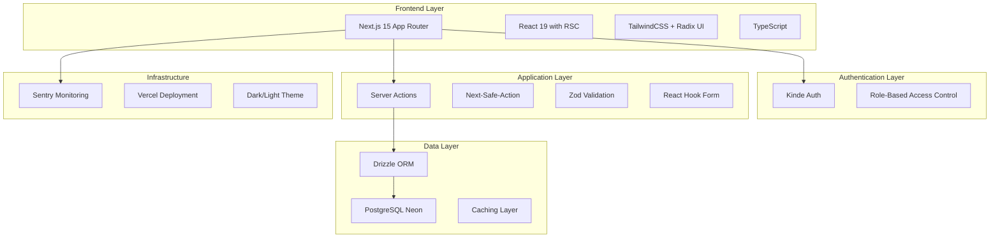
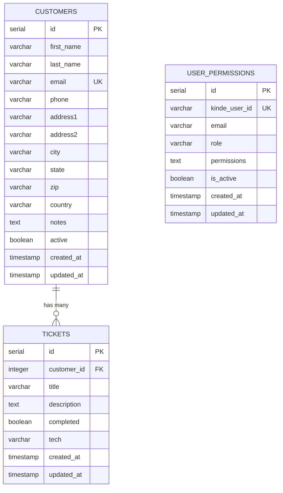
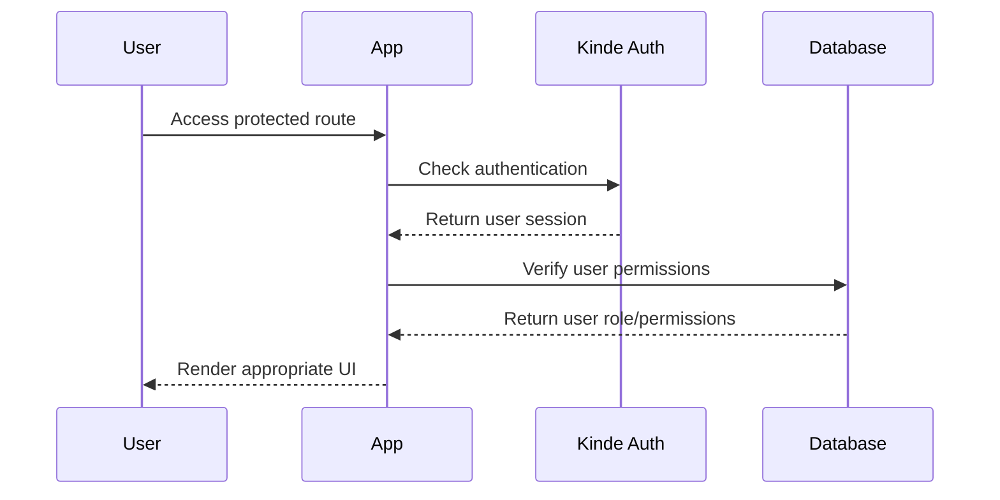
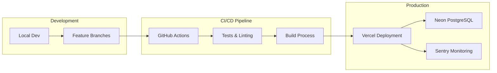

# 🏗️ Computer Repair Shop - System Design & Architecture

## 📋 System Overview

**Francisco Computer Repair Shop** is a comprehensive CRM and ticket management system built with modern web technologies, designed for professional computer repair businesses.

### 🎯 Core Business Requirements
- **Customer Management**: Complete customer profiles with contact information and service history
- **Ticket Tracking**: Repair ticket lifecycle management from creation to completion
- **User Authentication**: Role-based access control with manager/technician permissions
- **Real-time Updates**: Live data synchronization and polling for concurrent users
- **Search & Analytics**: Advanced search capabilities with performance monitoring

---

## 🏛️ Architecture Overview

### **Technology Stack**


### **Key Architectural Patterns**

#### 1. **Layered Architecture**
```
┌─────────────────────────────────────┐
│ Presentation Layer (Next.js Pages)  │
├─────────────────────────────────────┤
│ Business Logic (Server Actions)     │
├─────────────────────────────────────┤
│ Data Access (Drizzle ORM)          │
├─────────────────────────────────────┤
│ Database (PostgreSQL)              │
└─────────────────────────────────────┘
```

#### 2. **Component-Based Design System**
- **Atomic Design**: Base UI components (Button, Input, Card)
- **Composite Components**: Form components with integrated validation
- **Page-Level Components**: Feature-specific implementations
- **Layout Components**: Shared navigation and structure

#### 3. **Data Flow Architecture**
```
Client Request → Server Action → Validation → Database → Response → Client Update
```

---

## 🗄️ Database Schema Design

### **Entity Relationship Diagram**


### **Database Indexes & Performance**
```sql
-- Optimized indexes for common queries
CREATE INDEX customers_email_idx ON customers(email);
CREATE INDEX customers_active_idx ON customers(active);
CREATE INDEX tickets_customer_id_idx ON tickets(customer_id);
CREATE INDEX tickets_completed_idx ON tickets(completed);
CREATE INDEX tickets_tech_idx ON tickets(tech);
CREATE INDEX user_permissions_kinde_user_id_idx ON user_permissions(kinde_user_id);
```

---

## 🔧 Component System Design

### **Design System Hierarchy**

#### **1. Foundation Layer**
```typescript
// Base styling and theme system
interface ThemeConfig {
  colors: ColorPalette;
  typography: TypographyScale;
  spacing: SpacingScale;
  breakpoints: BreakpointConfig;
}

// Animation and transition system
const animations = {
  blob: "7s infinite",
  fadeIn: "0.3s ease-in-out",
  slideUp: "0.2s cubic-bezier(0.4, 0, 0.2, 1)"
};
```

#### **2. Primitive Components**
```typescript
// UI Component Interfaces
interface ButtonProps {
  variant: 'default' | 'destructive' | 'outline' | 'secondary' | 'ghost' | 'link';
  size: 'default' | 'sm' | 'lg' | 'icon';
  loading?: boolean;
  gradient?: boolean;
}

interface InputProps extends HTMLInputAttributes {
  error?: string;
  label?: string;
  required?: boolean;
}
```

#### **3. Composite Components**
```typescript
// Form System Components
interface FormSectionProps {
  title: string;
  description?: string;
  children: ReactNode;
  showDivider?: boolean;
}

interface FormWrapperProps {
  title: string;
  subtitle?: string;
  children: ReactNode;
  headerActions?: ReactNode;
}
```

#### **4. Feature Components**
```typescript
// Business Logic Components
interface CustomerTableProps {
  customers: Customer[];
  selectMode?: boolean;
  onSelect?: (customer: Customer) => void;
}

interface TicketFormProps {
  ticket?: Ticket;
  customerId?: number;
  onSubmit: (data: TicketFormData) => Promise<void>;
}
```

### **Component Design Patterns**

#### **Compound Component Pattern**
```typescript
// Search functionality
<SearchContainer>
  <SearchContainer.Input placeholder="Search..." />
  <SearchContainer.Results>
    {results.map(result => (
      <SearchContainer.Item key={result.id} {...result} />
    ))}
  </SearchContainer.Results>
</SearchContainer>
```

#### **Render Props Pattern**
```typescript
// Data fetching with polling
<DataProvider 
  fetcher={fetchTickets}
  pollingInterval={30000}
  render={({ data, loading, error, refetch }) => (
    <TicketList 
      tickets={data} 
      loading={loading} 
      onRefresh={refetch} 
    />
  )}
/>
```

---

## 🔌 API Design Specifications

### **Server Actions Architecture**
```typescript
// Type-safe server actions with validation
interface ServerActionResponse<T> {
  success: boolean;
  data?: T;
  error?: string;
  validationErrors?: Record<string, string[]>;
}

// Customer management actions
export async function createCustomer(
  data: InsertCustomerSchema
): Promise<ServerActionResponse<Customer>>;

export async function updateCustomer(
  data: UpdateCustomerSchema
): Promise<ServerActionResponse<Customer>>;

// Ticket management actions
export async function createTicket(
  data: InsertTicketSchema
): Promise<ServerActionResponse<Ticket>>;

export async function updateTicketStatus(
  id: number, 
  completed: boolean
): Promise<ServerActionResponse<Ticket>>;
```

### **API Endpoints Structure**
```typescript
// RESTful API design
/api/customers
  GET    /           # List customers with pagination/search
  POST   /           # Create new customer
  GET    /:id        # Get customer details
  PUT    /:id        # Update customer
  DELETE /:id        # Soft delete customer

/api/tickets
  GET    /           # List tickets with filters
  POST   /           # Create new ticket
  GET    /:id        # Get ticket details
  PUT    /:id        # Update ticket
  DELETE /:id        # Delete ticket
  
/api/search
  GET    /customers  # Search customers
  GET    /tickets    # Search tickets
```

### **Real-time Data Synchronization**
```typescript
// Polling strategy for live updates
interface PollingConfig {
  interval: number;        // 30000ms (30 seconds)
  maxRetries: number;      // 3 attempts
  backoffMultiplier: number; // 2x delay on retry
  enabled: boolean;        // Can be toggled
}

// Optimistic updates for better UX
interface OptimisticUpdate<T> {
  optimisticData: T;
  rollbackData: T;
  persistentUpdate: () => Promise<T>;
}
```

---

## 🔐 Security & Authentication Design

### **Authentication Flow**


### **Authorization Matrix**
```typescript
interface UserPermissions {
  role: 'manager' | 'technician' | 'viewer';
  permissions: {
    customers: {
      create: boolean;
      read: boolean;
      update: boolean;
      delete: boolean;
    };
    tickets: {
      create: boolean;
      read: boolean; // Own vs all tickets
      update: boolean;
      delete: boolean;
      assign: boolean; // Assign to technicians
    };
    users: {
      manage: boolean; // Manager only
    };
  };
}
```

### **Data Validation & Sanitization**
```typescript
// Zod schemas for type-safe validation
const customerSchema = z.object({
  firstName: z.string().min(1).max(255),
  lastName: z.string().min(1).max(255),
  email: z.string().email(),
  phone: z.string().regex(/^\+?[\d\s\-\(\)]+$/),
  // ... other fields with appropriate validation
});

// Input sanitization for XSS prevention
import DOMPurify from 'isomorphic-dompurify';

function sanitizeInput(input: string): string {
  return DOMPurify.sanitize(input, { 
    ALLOWED_TAGS: [],
    ALLOWED_ATTR: [] 
  });
}
```

---

## 📊 Performance & Monitoring Design

### **Performance Optimization Strategies**
```typescript
// Code splitting and lazy loading
const CustomerForm = lazy(() => import('./CustomerForm'));
const TicketTable = lazy(() => import('./TicketTable'));

// Image optimization
<Image
  src="/logo.png"
  alt="Company Logo"
  width={200}
  height={100}
  priority={true}
  placeholder="blur"
/>

// Database query optimization
const customersWithTicketCount = await db
  .select({
    ...customers,
    ticketCount: count(tickets.id)
  })
  .from(customers)
  .leftJoin(tickets, eq(customers.id, tickets.customerId))
  .groupBy(customers.id)
  .limit(10);
```

### **Monitoring & Analytics**
```typescript
// Sentry integration for error tracking
import * as Sentry from '@sentry/nextjs';

Sentry.captureException(error, {
  tags: { 
    component: 'CustomerForm',
    action: 'create_customer' 
  },
  extra: { formData: sanitizedData }
});

// Performance monitoring
const performanceTimer = Sentry.startTransaction({
  name: 'Customer Search',
  op: 'search'
});

// Custom analytics for search behavior
interface SearchAnalytics {
  query: string;
  resultCount: number;
  searchTime: number;
  filters: string[];
  userId: string;
}
```

---

## 🚀 Deployment & Infrastructure

### **Deployment Architecture**


### **Environment Configuration**
```typescript
// Environment-specific configurations
interface EnvironmentConfig {
  database: {
    url: string;
    maxConnections: number;
    sslMode: 'require' | 'disable';
  };
  auth: {
    kindeUrl: string;
    clientId: string;
    clientSecret: string;
  };
  monitoring: {
    sentryDsn: string;
    environment: 'development' | 'staging' | 'production';
  };
}
```

---

## 🔮 Future Enhancements & Scalability

### **Planned Features**
- **Real-time Notifications**: WebSocket integration for instant updates
- **Advanced Analytics**: Business intelligence dashboard
- **Mobile App**: React Native companion application
- **API Gateway**: Rate limiting and API versioning
- **Microservices**: Split into domain-specific services
- **File Uploads**: Document and image management system

### **Scalability Considerations**
- **Database Sharding**: Horizontal scaling strategies
- **Caching Layer**: Redis integration for session and data caching
- **CDN Integration**: Global content delivery optimization
- **Load Balancing**: Multi-region deployment strategy
- **Monitoring**: Advanced APM and observability tools

---

## 📚 Development Guidelines

### **Code Quality Standards**
- **TypeScript**: Strict type checking enabled
- **ESLint**: Consistent code style enforcement  
- **Testing**: Vitest for unit and integration tests
- **Documentation**: Comprehensive inline documentation
- **Git Workflow**: Feature branches with PR reviews

### **Performance Benchmarks**
- **Core Web Vitals**: LCP < 2.5s, FID < 100ms, CLS < 0.1
- **Bundle Size**: < 500KB initial load, < 2MB total
- **Database**: Query response time < 200ms average
- **API**: Server response time < 500ms for 95th percentile

---

*This system design serves as the foundation for building and scaling Francisco Computer Repair Shop's management system. Regular reviews and updates ensure the architecture remains aligned with business needs and technological advancements.*